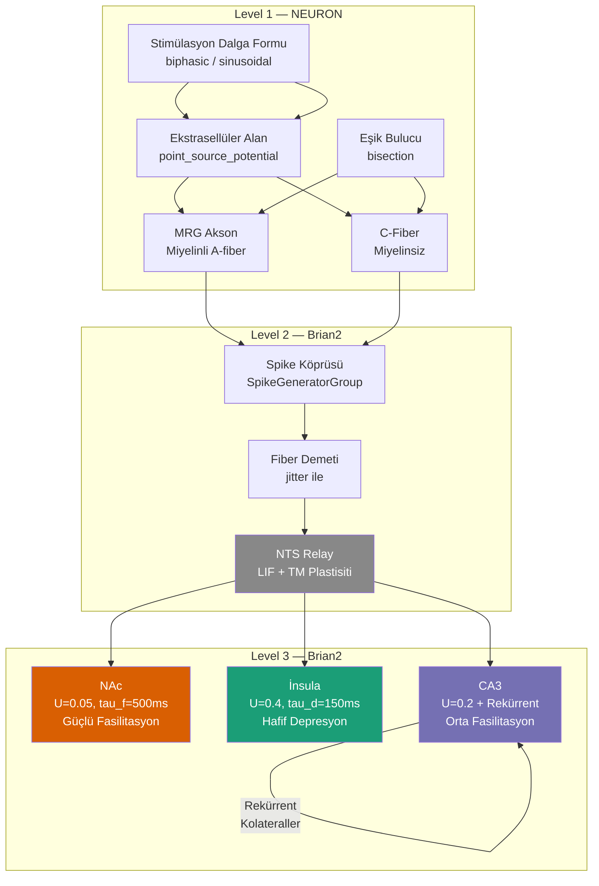

# 🧠 Notebook Derin Analiz — Frequency-Dependent Peripheral Nerve Stimulation

> [!NOTE]
> Bu doküman [nerve_frequency_study_colab.ipynb](file:///Volumes/harici/Documents/Ulusal%20Sinirbilimi%20Kongresi/ulusal-sinirbilim-kongresi/nerve_frequency_study_colab.ipynb) dosyasındaki **her bir** kavramı, terimi, modeli, yöntemi ve kısaltmayı en ince ayrıntısıyla açıklar.

---

## 📐 Büyük Resim — Projenin Amacı Ne?

Bu notebook, **periferik sinir stimülasyonunun (PNS)** farklı frekanslarının beynin farklı bölgelerinde nasıl farklı yanıtlar ürettiğini simüle ediyor. Yani sorulan soru şu:

> *"Vagus sinirini 5 Hz ile mi, 50 Hz ile mi, 200 Hz ile mi uyarırsam, NAc, insula ve CA3 gibi farklı beyin bölgelerindeki aktivite nasıl değişir?"*

Bu soru klinik olarak çok önemli çünkü **Vagus Sinir Stimülasyonu (VNS)** epilepsi, depresyon ve daha birçok hastalıkta kullanılan bir tedavi yöntemi ve hangi frekansın hangi bölgeyi aktive ettiğini bilmek, tedaviyi optimize etmek demek.

---

## 🏗️ Çok Ölçekli (Multi-Scale) Mimari

Notebook 3 seviye (level) içeriyor. Her seviye farklı bir biyolojik ölçeği temsil ediyor:

```
Level 1 (NEURON)          Level 2 (Brian2)              Level 3 (Brian2)
peripheral axon      →    NTS relay synapse        →    NAc / insula / CA3
(MRG or Sundt model)      (Tsodyks-Markram STP)         (population dynamics)
```

### Neden çok ölçekli?

Gerçek sinir sistemi böyle çalışır:
1. **Tek akson düzeyi** (mikrometre): İyon kanalları açılıp kapanır, aksiyon potansiyeli (AP) oluşur veya oluşmaz
2. **Sinaps düzeyi** (nanometre): AP bir sinaptik bağlantıya ulaşır, nörotransmitter salınır
3. **Ağ (network) düzeyi** (milimetre-santimetre): Binlerce nöronun kolektif davranışı

Her seviye farklı fiziksel yasalar ve zaman ölçekleri ile çalıştığı için, farklı simülatörler kullanılır. Bu yaklaşıma **multi-scale modeling** denir.

---

## 🔧 Kullanılan İki Simülatör ve Neden İkisi de Gerekli

### NEURON Simülatörü (Level 1)
- **Ne yapar:** Tek bir sinir lifinin (aksonun) biyofiziksel davranışını simüle eder
- **Nasıl çalışır:** Kablo denklemini (cable equation) çözer — aksonun her bir segmentinde membran potansiyelini hesaplar
- **Neden NEURON:** Morfologiye (şekil, çap, uzunluk) dayalı detaylı elektrofizyolojik simülasyon için altın standarttır. 1990'lardan beri Yale'de geliştiriliyor
- **Alternatifler:** GENESIS, Arbor, LFPy — ama NEURON, ModelDB'deki modellerin büyük çoğunluğuyla uyumludur
- **`h` nesnesi:** `from neuron import h` — NEURON'un HOC interpreter arayüzü. `h.Section()`, `h.fadvance()` gibi tüm NEURON komutları bu nesne üzerinden çağrılır
- **`stdrun.hoc`:** NEURON'un standart simülasyon kontrol prosedürlerini yükler (`init()`, `run()`, `continuerun()` gibi). Bu dosya olmadan `h.finitialize()` ve `h.fadvance()` düzgün çalışmaz

### Brian2 Simülatörü (Level 2-3)
- **Ne yapar:** Büyük nöron popülasyonlarının dinamiğini simüle eder
- **Nasıl çalışır:** Diferansiyel denklemleri metin (string) olarak alır ve otomatik olarak C++ koduna derleyip çalıştırır
- **Neden Brian2:** Hızlı prototipleme. Denklemleri Python string olarak yazarsınız, Brian2 geri kalanını halleder
- **Alternatifler:** NEST, PyNN, NetPyNE — ama Brian2 esneklik/hız dengesi için en iyilerden biri
- **`start_scope()`:** Brian2'deki tüm önceki nöron gruplarını, sinapsları ve monitörleri temizler. Her yeni simülasyon temiz bir sayfa ile başlar
- **`Network` nesnesi:** Simülasyondaki tüm bileşenleri (nöronlar, sinapslar, monitörler) açıkça bir araya toplar. Bunu kullanmazsanız Brian2 "magic network" modunda çalışır ve bazı bileşenleri sessizce atlayabilir

---

## ⚡ Bölüm 4: Ekstrasellüler Alan (Extracellular Field)

### `point_source_potential()` — Noktasal Kaynak Potansiyeli

```python
def point_source_potential(x, y, z, elec_pos, current, rho=300.0):
    r = np.sqrt((x - ex)**2 + (y - ey)**2 + (z - ez)**2)
    r_cm = np.maximum(r * 1e-4, 1e-6)
    return (rho * current) / (4 * np.pi * r_cm)
```

#### Ne yapıyor?
Bir noktasal akım kaynağının (elektrot) oluşturduğu **ekstrasellüler potansiyeli** (mV cinsinden) hesaplıyor.

#### Fizik Arka Planı
Bu, **Coulomb Yasası'nın** elektrofizyolojik versiyonudur. Temel denklem:

$$V_e = \frac{\rho \cdot I}{4\pi r}$$

- **V_e:** Ekstrasellüler potansiyel (mV)
- **ρ (rho):** Doku özgül direnci (Ω·cm). Varsayılan 300 Ω·cm — bu, **izotropik** (her yöne aynı iletkenlik) ve **homojen** (her yerde aynı) bir ortam varsayımıdır. Gerçekte doku anizotropiktir (akson boyunca vs. enine farklı iletkenlik)
- **I (current):** Elektrottan enjekte edilen akım (μA)
- **r:** Elektrot ile ölçüm noktası arasındaki mesafe (cm'ye dönüştürülüyor)
- **4π:** Küresel yayılım faktörü — akım noktadan eşit olarak her yöne dağılır

#### Referanslar
- **McNeal (1976):** Ekstrasellüler stimülasyon modellemesinin öncüsü — noktasal kaynak yaklaşımını ilk kullanan
- **Rattay (1986):** "Activating function" kavramını getirdi — ekstrasellüler potansiyelin ikinci uzaysal türevi, sinirin neresinin uyarılacağını belirler

#### `np.maximum(r * 1e-4, 1e-6)` — Singularite koruması
Elektrot tam sinirin üzerindeyse r=0 olur ve bölme hatası çıkar. Bu satır minimum mesafeyi 1e-6 cm ile sınırlar.

#### Neden noktasal kaynak?
Gerçek elektrotlar 3 boyutlu yapılardır, ama uzak alan yaklaşımında (far-field approximation) noktasal kaynak iyi çalışır. Alternatifler: **FEM (Finite Element Method)** modelleri — çok daha doğru ama çok daha yavaş.

---

### `biphasic_waveform()` — Uyarım Dalga Formu Üreteci

#### Biphasic (Çift Fazlı) Ne Demek?
- **Monofazik:** Yalnızca pozitif (veya yalnızca negatif) akım pulsu. Sorun: doku içinde net yük birikimi → elektrokimyasal hasar
- **Biphasic:** Pozitif puls + negatif puls. Net yük sıfır → güvenli. Bu yüzden klinik uygulamalarda biphasic tercih edilir
- **Interphase gap:** İki faz arasındaki boşluk (ms). Birinci fazın etkisinin tam oluşması için bekleme süresi

#### Dalga Formu Tipleri
1. **Rectangular (dikdörtgen):** Keskin açılıp-kapanan kare dalga. Düşük frekanslarda (1-500 Hz) kullanılır — net bir "ateşle/ateşleme" sinyali verir
2. **Sinusoidal (sinüsoidal):** Sürekli, yumuşak dalga. **KHFAC** (aşağıda açıklanıyor) için kullanılır

#### KHFAC Nedir?
**Kilohertz-Frequency Alternating Current** — Kilohertz frekanslı alternatif akım.

- **Ne yapar:** Sinir iletimini **bloke** eder (uyarmaz, tam tersi engellemek için kullanılır!)
- **Nasıl çalışır:** Yüksek frekanslı (tipik olarak 5-50 kHz) sinüsoidal akım, sodyum kanallarını kalıcı olarak inaktive eder. Kanal, açılma-kapanma döngüsünü takip edemez ve "donmuş" kalır
- **Klinik kullanım:** Kronik ağrıda istenmeyen sinir sinyallerini bloke etmek, mesane kontrolü
- **Notebook'taki yeri:** `waveform="sinusoidal"` seçeneği KHFAC blok deneyleri içindir

#### Parametreler
- **freq_hz:** Stimülasyon frekansı. 1 Hz'den 50 kHz'e kadar taranıyor
- **amp:** Akım genliği (μA)
- **pulse_width_ms=0.1:** Puls genişliği. 100 μs, sinir stimülasyonunda yaygın bir değer
- **duration_ms:** Toplam stimülasyon süresi

---

### `apply_extracellular_field()` — Alanı Aksona Uygulama

```python
for seg in sec:
    seg.e_extracellular = v_ext
```

#### `e_extracellular` Nedir?
NEURON'daki `extracellular` mekanizması, membranın dış yüzüne bir potansiyel ekler. Bu, intraselüler enjeksiyondan (IClamp) tamamen farklıdır:

- **IClamp:** Hücre içine doğrudan akım enjekte eder (laboratuvarda patch-clamp gibi)
- **Extracellular:** Hücre dışındaki ortamdaki potansiyeli değiştirir (klinik stimülasyon gibi)

Fark önemli çünkü **aktivasyon fonksiyonu** (activating function) = e_extracellular'ın uzay boyunca ikinci türevi. Yani sinir, potansiyelin kendisine değil, potansiyeldeki **uzaysal değişime** yanıt verir.

---

## 🔬 Bölüm 5: MRG Aksonu — Miyelinli Sinir Modeli

### MRG Modeli Nedir?
**McIntyre, Richardson, Grill (2002)** tarafından geliştirilen, periferik miyelinli sinir liflerinin en detaylı ve en yaygın kullanılan hesaplamalı modelidir.

- **ModelDB Accession: 3810** — herkesin indirip kullanabildiği açık kaynak model
- **Ne modelliyor:** A-fiber lifler (Aα, Aβ, Aδ) — motor sinirler, dokunma, propriosepsiyon

### Miyelinli Aksonun Anatomisi

```
[Node]---[Internode]---[Node]---[Internode]---[Node]
  1 μm      750 μm      1 μm      750 μm      1 μm
```

- **Ranvier Düğümü (Node of Ranvier):** Miyelinsiz kısa bölge (~1 μm). İyon kanalları burada yoğunlaşmıştır. Aksiyon potansiyeli burada yenilenir
- **Internode:** Miyelin kılıfıyla kaplı uzun bölge (500-1400 μm). Akım pasif olarak iletilir (kablo gibi)
- **Saltatory conduction (sıçrayıcı ileti):** AP düğümden düğüme "sıçrar" — bu yüzden miyelinli lifler hızlıdır (120 m/s'ye kadar!)

### `MRG_PARAMS` Sözlüğü

```python
MRG_PARAMS = {
    5.7: (1.9, 1.0, 500, 80),    # fiber_diam: (node_diam, node_length, internode_length, n_myelin_lamellae)
    8.7: (2.8, 1.0, 750, 110),
    12.8: (3.4, 1.0, 1150, 130),
    16.0: (4.7, 1.0, 1400, 150),
}
```

Her satır farklı bir fiber çapına karşılık gelir:

| Fiber Çapı (μm) | Lif Tipi | Fonksiyon | Düğüm Çapı | İnternod Uzunluğu | Miyelin Katmanı |
|:---:|:---:|:---:|:---:|:---:|:---:|
| 5.7 | Aδ | Ağrı, sıcaklık | 1.9 μm | 500 μm | 80 |
| 8.7 | Aβ | Dokunma | 2.8 μm | 750 μm | 110 |
| 12.8 | Aα | Motor, propriosepsiyon | 3.4 μm | 1150 μm | 130 |
| 16.0 | Aα (kalın) | Büyük motor | 4.7 μm | 1400 μm | 150 |

**Neden çap önemli?**
- Kalın fiber = düşük eşik (daha kolay uyarılır) + yüksek ileti hızı
- **Güç-süre eğrisi (strength-duration curve):** Kalın liflerin kronaksisi (chronaxie) daha kısadır
- Klinik sonuç: Düşük akımla önce kalın lifler uyarılır → "selectivity" sorusu ortaya çıkar

### `_has_mrg_mechanism()` ve HH Fallback

```python
def _has_mrg_mechanism():
    return hasattr(h, "axnode70") or hasattr(h, "MRGaxon")
```

- **`axnode70`:** MRG modelinin Ranvier düğümü mekanizması — Nav1.6, Nav1.1, geciktirilmiş K+, kalıcı Na+ kanalları içerir
- **Eğer yoksa:** Hodgkin-Huxley (HH) fallback kullanılır

### Hodgkin-Huxley (HH) Modeli — Fallback

**Nobel Ödülü 1963, Hodgkin & Huxley.** Modern hesaplamalı sinirbilimin temeli.

- **Ne modelliyor:** Kalamar dev aksonundaki aksiyon potansiyelini 4 diferansiyel denklemle:
  - `m`: Na+ kanal aktivasyonu (hızlı, açılma)
  - `h`: Na+ kanal inaktivasyonu (yavaş, kapanma)  
  - `n`: K+ kanal aktivasyonu (orta hız)
  - `V`: Membran potansiyeli

- **Neden fallback:** HH genel amaçlıdır; MRG ise periferik sinire özeldir. HH ile sonuçlar kalitatif olarak doğru ama kantitatif olarak tutarsızdır (eşikler, ileti hızları farklı çıkar)

### `pas` Mekanizması — Pasif Sızıntı (Leak) Kanalı

```python
node.insert("pas")
node.g_pas = 0.0001  # S/cm²
node.e_pas = -80     # mV
```

- **g_pas:** Sızıntı iletkenliği — membranın "arkaplan" geçirgenliği
- **e_pas:** Sızıntı tersine çevirme potansiyeli — bu, dinlenme potansiyelini belirleyen ana faktör
- **Biyolojik karşılığı:** İki-gözenekli K+ kanalları (K2P/KCNK) — her zaman biraz açıktır

### Internode Özellikleri

```python
inter.diam = self.diameter * 0.7   # Aksoplazma çapı, toplam çapın ~70%'i
inter.g_pas = 1e-6                  # Çok düşük sızıntı — miyelin çok iyi yalıtır
```

- `0.7` çarpanı: Miyelin kılıfı çapı değil, içteki akson çapıdır (g-ratio ≈ 0.7)
- **g-ratio:** İç akson çapı / toplam fiber çapı. ~0.6-0.7 optimal — daha düşükse ileti yavaşlar, daha yüksekse miyelin yetersiz kalır

### `nseg` — Segmentasyon

```python
node.nseg = 1       # Düğüm: 1 μm, tek segment yeterli
inter.nseg = 6      # Internode: 750 μm, 6 segment
```

NEURON, her section'ı `nseg` sayıda kompartmana böler. Her kompartman bağımsız bir elektriksel birim gibi davranır (isospatial compartment). Kural: **her λ/10 (uzay sabiti'nin 1/10'u) için 1 segment**. Yetersiz segmentasyon → sayısal hata; aşırı segmentasyon → gereksiz yavaşlık.

### `connect()` — Topolojik Bağlantı

```python
self.internodes[i].connect(self.nodes[i](1), 0)
self.nodes[i + 1].connect(self.internodes[i](1), 0)
```

- `(1)`: Section'ın **distal** ucunu temsil eder (0=proximal, 1=distal)
- Bu bağlantılar node→internode→node zincirini oluşturur

### `NetCon` ve Spike Kaydı

```python
nc = h.NetCon(self.nodes[-1](0.5)._ref_v, None, sec=self.nodes[-1])
nc.threshold = -20
spike_times = h.Vector()
nc.record(spike_times)
```

- **NetCon:** NEURON'daki "ağ bağlantısı" nesnesi. Burada hedef `None` — yani sinaptik hedef yok, sadece izleme amaçlı
- **threshold=-20 mV:** Membran potansiyeli -20 mV'u geçtiğinde "spike var" sayılır
- **`_ref_v`:** Potansiyelin referansı (pointer) — NEURON'un C-düzeyi iç mekanizması
- **Son düğüm `[-1]`:** Aksonun distal ucu — buraya spike ulaşırsa "iletim başarılı" demektir

---

## 🔴 Bölüm 6: C-Fiber (Unmyelinated — Miyelinsiz Lif) Modeli

### C-Fiber Nedir?
- **Miyelinsiz:** Miyelin kılıfı yok, sürekli (continuous) ileti
- **İnce:** 0.2-1.5 μm çap
- **Yavaş:** 0.5-2 m/s ileti hızı (A-fiber'ın 1/60'ı!)
- **Fonksiyon:** Ağrı (nosisepsiyon), sıcaklık, visseral afferent (organ duyuları — vagus sinirinin çoğunluğu C-fiberdir!)

### Sundt/Gamper/Jaffe Modeli (2015)

- **ModelDB Accession: 189712**
- **Ne farkı var:** HH'dan farklı olarak, özellikle C-fiber iyon kanallarını modelliyor:
  - **`nahh`:** C-fiber'a özgü Na+ kanal kinetiği (Nav1.7, Nav1.8, Nav1.9 — ağrı araştırmasının hedef kanalları!)
  - **`borgkdr`:** Geciktirilmiş düzeltici K+ kanalı (delayed rectifier)

### Parametreler

```python
diameter_um=0.8    # C-fiber çapı (tipik: 0.4-1.2 μm)
length_um=20000    # 20 mm = 2 cm
seg_length_um=100  # Her 100 μm'de bir kompartman → 200 segment
```

- **Neden 2 cm?** Kısa aksonlarda sınır koşulları (sealed-end) yapay yansımalar üretebilir. 2 cm, elektrot konumundan yeterince uzak uçlar sağlar

### MRG vs C-Fiber: Kilit Farklar

| Özellik | MRG (A-fiber) | C-Fiber |
|:---|:---:|:---:|
| Miyelin | ✅ Var | ❌ Yok |
| Yapı | Düğüm + internode | Sürekli tek section |
| Çap | 5.7-16 μm | 0.4-1.5 μm |
| İleti hızı | 30-120 m/s | 0.5-2 m/s |
| Eşik | Düşük | Yüksek |
| Na+ kanalları | Nav1.6, Nav1.1 | Nav1.7, Nav1.8, Nav1.9 |
| Klinik ilgi | Motor, dokunma | Ağrı, visseral duyu |

---

## 🎯 Bölüm 7: Eşik Bulucu (Threshold Finder)

### `find_threshold()` — Bisection (İkiye Bölme) Yöntemi

```python
def find_threshold(run_trial_fn, amp_low, amp_high, tol=1e-4, max_iter=30):
```

#### Algoritma
1. `lo` ve `hi` arasında bir orta nokta seç: `mid = (lo + hi) / 2`
2. `mid` ile deneme yap: spike oluştu mu?
3. Spike varsa: `hi = mid` (eşik daha düşükte olabilir)
4. Spike yoksa: `lo = mid` (eşik daha yüksekte olmalı)
5. `hi - lo < tol` olana kadar tekrarla

#### Neden bisection?
- **Basit ve güvenilir:** Monoton fonksiyonlarda kesin yakınsama garantisi
- **Alternatifler:** Newton-Raphson (daha hızlı ama türev gerektirir), Brent's method (bisection + secant hibrit)
- **30 iterasyon:** 2^30 ≈ 10^9 — başlangıç aralığını milyar kat daraltır

#### İki Mod
1. **Activation threshold:** "Minimum ne kadar akım vermeliyim ki spike oluşsun?" (düşük frekans)
2. **Block threshold (KHFAC):** "Minimum ne kadar KHFAC akımı vermeliyim ki iletim bloke olsun?" (yüksek frekans)

### `verify_bracket()` — Aralık Doğrulama

```python
def verify_bracket(run_trial_fn, amp_low, amp_high, expand_factor=2.0, max_expansions=10):
```

Bisection'ın çalışması için, aralığın bir ucunun "evet" diğer ucunun "hayır" vermesi gerekir. Bu fonksiyon, `hi` sınırını 2 katına çıkararak uygun bir aralık bulur (en fazla 10 kez → 2^10 = 1024 kat genişleme).

---

## 📡 Bölüm 8: Frekans Tarama Protokolü

### `ELECTRODE_POS = (500.0, 0.0, 5000.0)` — Elektrot Konumu

- **(500, 0, 5000) μm** = aksondan 500 μm uzakta, z ekseni boyunca 5 mm konumda
- Bu mesafe önemli: yakınsa çok güçlü alan, uzaksa zayıf alan. 500 μm, periferik sinir stimülasyonunda tipik bir cuff/electrode mesafesidir

### `_run_activation_trial()` — Aktivasyon Denemesi

```python
h.finitialize(-65)    # Membranı -65 mV'da başlat (tipik dinlenme potansiyeli)
for i_t in i_vec:
    apply_extracellular_field(sections, coords, ELECTRODE_POS, i_t)
    h.fadvance()       # Bir zaman adımı (dt=0.005 ms = 5 μs) ilerle
return spikes.size() > 0  # En az 1 spike varsa True
```

#### `h.finitialize(-65)` 
Tüm değişkenleri başlangıç değerlerine ayarlar:
- V = -65 mV (membran potansiyeli)
- İyon kanal durumları: Na+ kanalı kapalı, K+ kanalı kapalı
- Tüm akımlar = 0

#### `h.fadvance()`
Tek bir `dt` zaman adımı ilerler:
1. Tüm iyon kanalı denklemlerini çözer (Hodgkin-Huxley formalizmi)
2. Kablo denklemini çözer (kompartmanlar arası akım)
3. Membran potansiyelini günceller

Bu, **Euler** veya **implicit (Crank-Nicolson)** integrasyon yöntemiyle yapılır. `dt=0.005 ms = 5 μs` — yüksek frekanslı stimülasyon için yeterli temporal çözünürlük.

### `_run_block_trial()` — Blok Denemesi

```python
waveform="sinusoidal"    # KHFAC için sinüsoidal dalga
test_pulse_time_ms=50    # 50 ms'de bir test pulsu gönder
test_pulse_amp=2.0       # Test pulsu genliği
```

#### Blok nasıl test edilir?
1. Yüksek frekanslı sinüsoidal akım başlat (KHFAC)
2. 50 ms bekle (Na+ kanallarının inaktive olması için)
3. Bir test pulsu gönder (normal koşullarda spike oluşturması beklenen güçte)
4. Test pulsu spike oluşturamadıysa → blok başarılı!

### `default_frequency_range()` — Frekans Aralığı

```python
low = [1, 2, 5, 10, 20, 50, 100, 200, 500]       # Hz — aktivasyon bölgesi
high = [1000, 2000, 5000, 10000, 20000, 50000]     # Hz — blok bölgesi (KHFAC)
```

**Logaritmik dağılım** kullanılıyor çünkü sinir sistemi logaritmik ölçekte çalışır (Weber-Fechner yasası).

### `sweep_fiber()` — Ana Tarama Fonksiyonu

Her frekans için:
1. Yeni bir fiber oluştur (clean state)
2. Aralığı doğrula (`verify_bracket`)
3. Eşiği bul (`find_threshold`)
4. Sonuçları kaydet

---

## 🌉 Bölüm 9: NEURON → Brian2 Köprüsü

### `neuron_spikes_to_brian_group()` — Spike Zamanlarını Brian2'ye Aktarma

```python
SpikeGeneratorGroup(n_fibers, indices, times)
```

- **SpikeGeneratorGroup:** Brian2'de "sahte" nöron grubu — gerçek denklem çözmez, verilen zamanlarda spike üretir
- **Neden gerekli:** NEURON ve Brian2 ayrı simülatörler, ortak bellek paylaşmaz. NEURON'dan çıkan spike zamanları (ms olarak bir dizi sayı), Brian2'nin anlayacağı formata dönüştürülür
- Bu yaklaşıma **"offline coupling"** veya **"one-way coupling"** denir

### `merge_fiber_populations()` — Çoklu Fiber Birleştirme

Birden fazla fiber'ın spike zamanlarını tek bir SpikeGeneratorGroup'ta birleştirir. Her fiberin kendi indeksi vardır.

---

## 🧬 NTS (Nucleus Tractus Solitarius) — Çekirdek

### NTS Nedir?
**Beyin sapındaki ilk röle istasyonu.** Vagus sinirinin afferent lifleri buraya sinaps yapar.

- **Konum:** Medulla oblongata (beyin sapı)
- **Fonksiyon:** Kardiyovasküler, solunum, gastrointestinal reflekslerin merkezi
- **VNS bağlamı:** Elektriksel stimülasyon → vagus afferentleri → NTS → yukarı beyin bölgeleri

### NTS Nöron Modeli — LIF (Leaky Integrate-and-Fire)

```python
NTS_EQS = """
dv/dt = (v_rest - v + g_syn*(E_syn - v)/gL) / tau_m : volt (unless refractory)
dg_syn/dt = -g_syn / tau_syn : siemens
"""
```

#### LIF Nedir?
**Leaky Integrate-and-Fire** — en basit biologically plausible nöron modeli:
- **Leaky:** Membran sızıntısı var — uyarım olmadan potansiyel dinlenme değerine döner
- **Integrate:** Gelen sinaptik akımları toplar (entegre eder)
- **Fire:** Eşiği aşınca spike üretir ve sıfırlanır

#### Denklemin Parçaları

| Terim | Anlam |
|:---|:---|
| `v_rest - v` | Sızıntı terimi: V'yi -65 mV'a çeker |
| `g_syn*(E_syn - v)/gL` | Sinaptik akım: g_syn büyükse V'yi E_syn'e (0 mV) çeker |
| `tau_m = 20 ms` | Membran zaman sabiti: potansiyelin ne kadar hızlı değiştiğini belirler |
| `tau_syn = 5 ms` | Sinaptik iletkenliğin azalma hızı |
| `unless refractory` | 2 ms boyunca yeni spike üretemez (mutlak refrakter periyod) |

#### Neden LIF, neden HH değil?
- LIF: 2 denklem, hızlı, büyük ağlarda kullanılabilir
- HH: 4 denklem, yavaş, ama spike şekli realistik
- Bu notebook'ta **spike şekli değil, spike zamanlaması** önemli → LIF yeterli

#### LIF'in Alternatifleri
- **Izhikevich modeli:** LIF kadar hızlı ama bursting/adaptation gibi zengin davranışlar üretebilir
- **AdEx (Adaptive Exponential):** LIF + adaptasyon akımı + keskin spike başlangıcı
- **EIF (Exponential IF):** Spike eşiğini yumuşatan exponential terim

### Parametre Değerleri

| Parametre | Değer | Anlam |
|:---|:---:|:---|
| `v_rest` | -65 mV | Dinlenme potansiyeli |
| `E_syn` | 0 mV | Eksitasyonlu sinaptik tersine çevirme potansiyeli (AMPA benzeri) |
| `gL` | 10 nS | Sızıntı iletkenliği |
| `tau_m` | 20 ms | Membran zaman sabiti |
| `tau_syn` | 5 ms | Sinaptik zaman sabiti |
| `threshold` | -50 mV | Spike eşiği |
| `reset` | -65 mV | Spike sonrası sıfırlama |

---

## 🔄 Tsodyks-Markram (TM) Sinaptik Plastisiti Modeli

Bu notebook'un **en kritik mekanizması** — frekansa bağlı bölgesel ayrışımın (dissociation) kaynağı budur.

### Kısa Süreli Plastisiti (STP) Nedir?

Sinapslar sabit değildir. Art arda gelen spike'lar sinaptik gücü değiştirir:
- **STD (Short-Term Depression):** Art arda spike'larla sinaptik güç **azalır** — vezikül tükenmes
- **STF (Short-Term Facilitation):** Art arda spike'larla sinaptik güç **artar** — kalsiyum birikimi

### TM Modeli Denklemleri

```python
TM_SYN_EQS = """
w : siemens              # Maksimum sinaptik ağırlık
U : 1                    # Temel salınım olasılığı (dimensionless)
tau_f : second           # Fasilitasyon zaman sabiti
tau_d : second           # Depresyon (toparlanma) zaman sabiti
du/dt = -u / tau_f : 1   # u: anlık salınım olasılığı (event-driven)
dx/dt = (1 - x) / tau_d : 1   # x: mevcut vezikül fraksiyonu (event-driven)
"""

TM_ON_PRE = """
u += U * (1 - u)         # Fasilitasyon: her spike u'yu artırır
g_syn_post += w * u * x  # Efektif sinaptik iletkenlik = w × u × x
x -= u * x               # Depresyon: kullanılan vezikülü çıkar
"""
```

#### Değişkenler

| Değişken | Başlangıç | Anlam |
|:---|:---:|:---|
| `u` | U | **Anlık salınım olasılığı** — her spike geldiğinde artar, spike yokken tau_f ile azalır |
| `x` | 1.0 | **Mevcut vezikül fraksiyonu** — her spike'ta azalır (u×x kadar), spike yokken tau_d ile toparlanır |
| `w` | değişken | **Maksimum sinaptik ağırlık** (siemens cinsinden) |
| `U` | 0.05-0.5 | **Temel kullanım olasılığı** — düşükse fasilitasyon dominant, yüksekse depresyon dominant |

#### Spike Geldiğinde Ne Olur?

1. **`u += U * (1 - u)`:** Fasilitasyon adımı. u her spike'ta biraz daha artar (tavana yaklaştıkça artış yavaşlar)
2. **`g_syn_post += w * u * x`:** Postsinaptik nörona iletilen iletkenlik = w (max ağırlık) × u (salınım olasılığı) × x (mevcut stok)
3. **`x -= u * x`:** Depresyon adımı. Kullanılan kadar vezikül stoktan düşer

#### Spike Yokken Ne Olur?

- `u` → `tau_f` zaman sabitiyle 0'a doğru azalır (fasilitasyonun "unutulması")
- `x` → `tau_d` zaman sabitiyle 1'e doğru toparlanır (veziküllerin yeniden doldurulması)

#### `event-driven` Ne Demek?

Brian2'de `(event-driven)` ifadesi, bu denklemin yalnızca bir spike olayı gerçekleştiğinde analitik olarak çözüldüğünü, her zaman adımında sayısal olarak hesaplanmadığını belirtir. Bu çok daha hızlıdır çünkü denklem yalnızca spike zamanlarında güncellenir.

### Depressing vs Facilitating Sinaps Karşılaştırması

| Özellik | Depressing | Facilitating |
|:---|:---:|:---:|
| U (kullanım olasılığı) | 0.5 (yüksek) | 0.05-0.15 (düşük) |
| tau_f (fasilitasyon) | 20 ms (kısa) | 500-600 ms (uzun) |
| tau_d (toparlanma) | 700 ms (uzun) | 50-100 ms (kısa) |
| Düşük frekansta | Her spike güçlü | Her spike zayıf |
| Yüksek frekansta | Güç hızla azalır | Güç birikir ve artar |
| Biyolojik rolü | Onset detektörü | Frekans filtresi |

> [!IMPORTANT]
> **Bu tablo projenin kalbidir.** Farklı beyin bölgelerine giden yollar farklı TM parametreleri kullanarak, aynı giriş frekansına farklı yanıtlar üretir. Bu mekanizma, "neden 100 Hz NAc'yi aktive ederken 10 Hz etmiyor?" sorusunun cevabıdır.

---

## 🧠 Bölüm 9-12: Downstream Beyin Bölgeleri

### NAc — Nucleus Accumbens

- **Konum:** Bazal ganglia (ventral striatum)
- **Fonksiyon:** Ödül, motivasyon, "isteme" (wanting) — dopaminerjik sistem
- **VNS bağlamı:** NTS → Locus Coeruleus (LC) → VTA → NAc yolağı — depresyon tedavisinde hedef
- **Model:** `tau_m = 25-30 ms` (biraz yavaş membran — medium spiny neuron'lar)
- **Pathway:** **Güçlü fasilitasyon** (`U=0.05, tau_f=500 ms`) → düşük frekansta sessiz, yüksek frekansta aktif
- **Klinik çıkarım:** VNS'de anti-depresan etki muhtemelen yüksek frekans stimülasyonla NAc'nin aktive edilmesiyle ilişkili

### Insula — İnsüla Korteksi

- **Konum:** Lateral sulkus içinde (temporal ve parietal lob arasında gizli)
- **Fonksiyon:** İnterosepsiyon (iç organ farkındalığı), ağrı algısı, duygusal farkındalık
- **VNS bağlamı:** NTS → Talamus (VPM/VPL) → İnsula yolağı — **Craig (2002) mimarisi**
- **Model:** `tau_m = 20 ms` — daha hızlı yanıt
- **Pathway:** Hafif depresyon (`U=0.4, tau_d=150 ms`) → düşük frekanstan itibaren yanıt, direkt röle
- **Not:** Gerçek anatomide talamatik bir ara istasyon var — bu model basitleştirilmiş

### CA3 — Cornu Ammonis 3 (Hipokampüs)

- **Konum:** Hipokampüsün ortasında
- **Fonksiyon:** Episodik bellek, örüntü tamamlama (pattern completion)
- **Özel özellik:** **Rekürrent kolateraller** — CA3 nöronları birbirine bağlanır (autoassociative network)
- **VNS bağlamı:** NTS → Septum / Entorhinal korteks → Hipokampüs — bellek güçlendirme
- **Model:** `tau_m = 20 ms` + rekürrent sinapslar

### CA3 Rekürrent Kolateraller

```python
recurrent_syn = Synapses(pop, pop, on_pre="g_syn_post += w", model="w : siemens")
recurrent_syn.connect(condition="i != j", p=recurrent_p)
```

- `"i != j"`: Nöron kendine bağlanmaz (autapse yok)
- `p=0.1-0.12`: Bağlantı olasılığı — gerçek CA3'te ~%5-10
- **Runaway excitation tehlikesi:** Rekürrent bağlantılar pozitif geri besleme oluşturur. İnhibisyon (internöron) olmadan, güçlü ağırlıklar → kontrolsüz ateşleme → yapay sonuçlar
- **Çözüm:** `recurrent_w = 0.6-1.0 nS` (düşük tutulmuş) + `refractory = 3 ms`
- **Gelecek iyileştirme:** GABAerjik inhibitör internöron popülasyonu eklemek

---

## 🔗 Bölüm 10: Uçtan Uca Pipeline

### `run_level1()` — NEURON Seviyesi

```python
fiber = MRGAxon(diameter_um=8.7, n_nodes=15)
elec_pos = (500.0, 0.0, 3000.0)    # Aksonun ortasına yakın
```

- **15 düğüm:** Tipik olarak 21 düğüm kullanılır ama 15 yeterli ve daha hızlı
- **Elektrot konumu (3000 μm):** z ekseni boyunca aksonun ortasına yakın — en etkili uyarım noktası

### `run_levels_2_3()` — Brian2 Seviyesi

```python
nts, make_synapses = build_nts_relay(n_nts_neurons=30, synapse_type="depressing")
ca3_pop, ca3_recurrent = build_ca3(n=100)
relay_to_ca3 = connect_region(nts, ca3_pop, p=0.25)
```

- **30 NTS nöronu:** Küçük ama yeterli popülasyon
- **100 CA3 nöronu:** Gerçekte milyonlarca var, ama dinamik özellikleri yakalamak için 100 yeterli
- **`p=0.25`:** NTS→CA3 bağlantı olasılığı — sparse (seyrek) bağlantı

---

## 📊 Bölüm 11: Çoklu Frekans / Çoklu Bölge Karşılaştırması

### `bundle_from_single_fiber()` — Fiber Demeti

```python
def bundle_from_single_fiber(spike_times_ms, n_fibers=20, jitter_ms=0.4, seed=0):
```

#### Neden bundle (demet)?
Tek bir fiber ile downstream ağı sürmek gerçekçi değil:
1. **Gerçek vagus siniri:** ~80,000 lif içerir
2. **Tek fiber → deterministic:** Tüm postsinaptik nöronlar aynı anda, aynı girişi alır → hepsi "on/off" geçiş yapar → frekans duyarlılığı gizlenir
3. **Demet → stochastic:** Her fiber biraz farklı zamanda spike üretir → popülasyon yanıtı gradüel olur

#### Jitter (Zamanlama Titreşimi)
```python
jittered = np.array(spike_times_ms) + rng.normal(0, jitter_ms, size=len(spike_times_ms))
```
- **jitter_ms=0.4:** Her fiber'ın spike zamanına Gauss gürültüsü eklenir (σ=0.4 ms)
- Biyolojik karşılık: Liflerin farklı ileti hızları, farklı eşikleri, farklı miyelin kalınlıkları

### Pathway Tasarımı — Dissociasyonun Kaynağı

#### NTS → NAc Yolağı (Güçlü Fasilitasyon)
```python
c_nac = make_tm_conn(nts, nac_pop, U=0.05, tau_f=500*ms, tau_d=100*ms, p=0.3, w=9*nS)
```
- `U=0.05`: İlk spike'ta yalnızca %5 vezikül salınır — çok zayıf
- `tau_f=500 ms`: Fasilitasyon yarı-ömrü 500 ms — art arda spike'lar u'yu biriktirir
- **Sonuç:** Düşük frekansta (1-20 Hz) spike'lar arası süre > tau_f → fasilitasyon sönümlenir → eşik aşılmaz → **sessiz**
- Yüksek frekansta (50+ Hz) spike'lar hızlı gelir → u birikir → eşik aşılır → **aktif**

#### NTS → İnsula Yolağı (Hafif Depresyon)
```python
c_insula = make_tm_conn(nts, insula_pop, U=0.4, tau_f=10*ms, tau_d=150*ms, p=0.3, w=7*nS)
```
- `U=0.4`: İlk spike'ta %40 vezikül salınır — güçlü başlangıç yanıtı
- `tau_d=150 ms`: Depresyon toparlanması hızlı
- **Sonuç:** Düşük frekansta bile yanıt var — direkt röle gibi çalışır

#### NTS → CA3 Yolağı (Orta Fasilitasyon + Rekürrent)
```python
c_ca3 = make_tm_conn(nts, ca3_pop, U=0.2, tau_f=150*ms, tau_d=300*ms, p=0.3, w=6*nS)
```
- İnsula benzeri düşük frekans yanıtı + rekürrent amplifikasyon ile yüksek frekansta ayrışma

### `cycles_to_duration_ms()` — Adaptif Süre

```python
def cycles_to_duration_ms(freq_hz, n_cycles=8, min_ms=200, max_ms=1000):
    return float(min(max_ms, max(min_ms, n_cycles * 1000.0 / freq_hz)))
```

- **Sorun:** 1 Hz'de 200 ms = yalnızca 0.2 döngü (anlamsız). 500 Hz'de 1000 ms = 500 döngü (gereksiz yavaş)
- **Çözüm:** Her zaman en az 8 döngü, ama minimum 200 ms - maksimum 1000 ms ile sınırlı

---

## 📈 Bölüm 11 (devam): Görselleştirme

### Figure 1 — Bölgesel Frekans-Yanıt Eğrileri

- **X ekseni:** Stimülasyon frekansı (log ölçek — Weber-Fechner)
- **Y ekseni:** Ortalama ateşleme hızı (Hz/nöron)
- **Beklenen sonuç:** NAc yalnızca yüksek frekansta aktifleşir, İnsula tüm frekanslarda, CA3 ortada ama yüksekte öne çıkar

### Figure 2 — Isı Haritası (Heatmap)

- Satırlar: Bölgeler (NAc, İnsula, CA3, NTS)
- Sütunlar: Frekanslar
- Renk: Ateşleme hızı (viridis renk haritası — koyu=düşük, sarı=yüksek)

### Figure 3 — Gruplandırılmış Çubuk Grafik

- Her frekans için bölgelerin yan yana karşılaştırılması

### Dissociation Table

```python
ACTIVE_THRESHOLD_HZ = 0.5
dissociation[region + "_active"] = dissociation[region] > ACTIVE_THRESHOLD_HZ
```

Her bölge 0.5 Hz/nöron üzerinde ateşliyorsa "aktif" sayılır → ikili (bool) tablo.

---

## ⚠️ Önemli Uyarılar (Caveats)

1. **El ayarı (hand-tuned) parametreler:** TM parametreleri gerçek elektrofizyoloji verilerine fit edilmemiş, demostrasyon amaçlı ayarlanmış
2. **Tek stokastik deneme:** Her frekans 1 kez çalıştırılıyor — güvenilir sonuç için 5-10 tekrar gerekli
3. **20 fiber sınırlaması:** Gerçek vagus 80,000 fiber → daha fazla fiber daha pürüzsüz yanıtlar
4. **İnhibisyon eksikliği:** CA3'te GABAerjik internöronlar yok → rekürrent ağırlık yapay olarak düşük tutulmuş
5. **Talamik röle eksik:** İnsula yolağında NTS→Talamus→İnsula yerine NTS→İnsula doğrudan bağlantı var

---

## 📚 Temel Referanslar Özeti

| Referans | Yıl | Katkı |
|:---|:---:|:---|
| **Hodgkin & Huxley** | 1952 | Aksiyon potansiyeli matematiksel modeli (Nobel 1963) |
| **McNeal** | 1976 | Ekstrasellüler stimülasyon modellemesi |
| **Rattay** | 1986 | Activating function kavramı |
| **Tsodyks & Markram** | 1997 | Kısa süreli sinaptik plastisiti modeli |
| **McIntyre, Richardson, Grill** | 2002 | MRG miyelinli akson modeli |
| **Craig** | 2002 | İnteroseptif afferent yolak mimarisi |
| **Sundt, Gamper, Jaffe** | 2015 | C-fiber iyon kanal modeli |

---

## 🗺️ Kavram Haritası — Tüm İlişkiler



---

## 🔑 Anahtar Kavramlar Sözlüğü

| Terim | Açıklama |
|:---|:---|
| **AP (Action Potential)** | Aksiyon potansiyeli — nöronun "ateşleme" sinyali (~1 ms, ~100 mV genlik) |
| **Afferent** | Duyusal — çevreden merkeze (beyne) doğru sinyal taşıyan sinir |
| **Biphasic** | Çift fazlı — pozitif + negatif puls (yük dengesi için) |
| **Bisection** | İkiye bölme — bir fonksiyonun kökünü bulma algoritması |
| **Cable equation** | Kablo denklemi — uzun silindirik yapıda (akson) akım yayılımının matematiksel tanımı |
| **Chronaxie** | Kronaksi — eşik akımın 2 katı ile spike oluşturmak için gereken minimum puls süresi |
| **Cuff electrode** | Siniri saran yüksük şeklinde elektrot — periferik sinir stimülasyonunda yaygın |
| **e_extracellular** | NEURON'daki dış ortam potansiyeli değişkeni |
| **Euler method** | En basit sayısal integrasyon yöntemi — y(t+dt) = y(t) + dt × f(t,y) |
| **Event-driven** | Olay güdümlü — yalnızca spike olduğunda hesaplanan diferansiyel denklem |
| **Facilitating** | Kolaylaştırıcı — art arda spike'larla güçlenen sinaps |
| **g-ratio** | İç akson çapı / toplam fiber çapı (optimal ~0.7) |
| **KHFAC** | Kilohertz-Frequency Alternating Current — sinir bloğu için yüksek frekanslı akım |
| **LIF** | Leaky Integrate-and-Fire — basit nöron modeli |
| **ModelDB** | Yale'de barındırılan hesaplamalı sinirbilim model veritabanı |
| **Myelin** | Miyelin — aksonları saran yalıtkan tabaka (oligodendrosit veya Schwann hücresi) |
| **nrnivmodl** | NEURON mekanizma derleyicisi — .mod dosyalarını paylaşımlı kütüphaneye derler |
| **PNS** | Peripheral Nerve Stimulation — periferik sinir stimülasyonu |
| **Raster plot** | Her nöronun spike zamanlarını gösteren nokta grafiği |
| **Refractory period** | Refrakter periyod — spike sonrası yeni spike üretilemeyen süre |
| **Saltatory conduction** | Sıçrayıcı ileti — AP'nin Ranvier düğümleri arasında sıçraması |
| **Segment** | NEURON'daki en küçük hesaplama birimi (kompartman) |
| **STP** | Short-Term Plasticity — kısa süreli sinaptik plastisiti |
| **STD** | Short-Term Depression — kısa süreli sinaptik depresyon |
| **STF** | Short-Term Facilitation — kısa süreli sinaptik fasilitasyon |
| **Threshold** | Eşik — aksiyon potansiyeli oluşturmak için gereken minimum uyarım |
| **VNS** | Vagus Nerve Stimulation — vagus sinir stimülasyonu |
| **Weber-Fechner** | Duyusal algının logaritmik ölçekte arttığını belirten psikofizik yasası |
